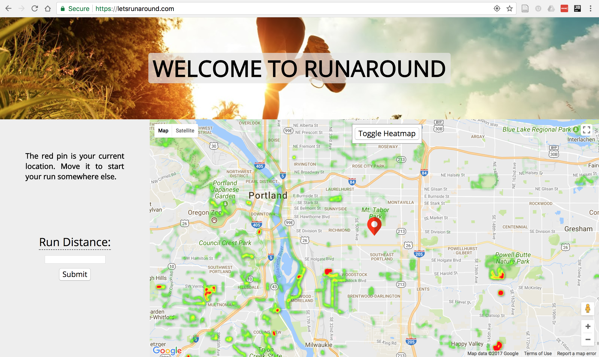
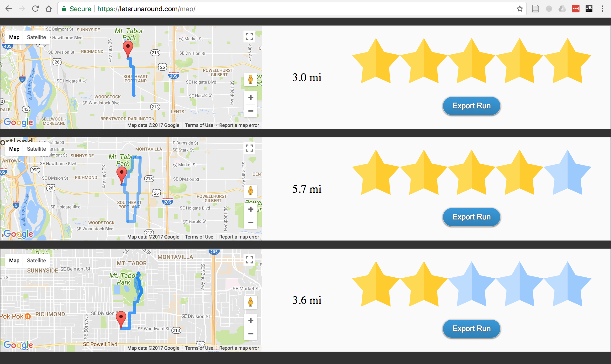
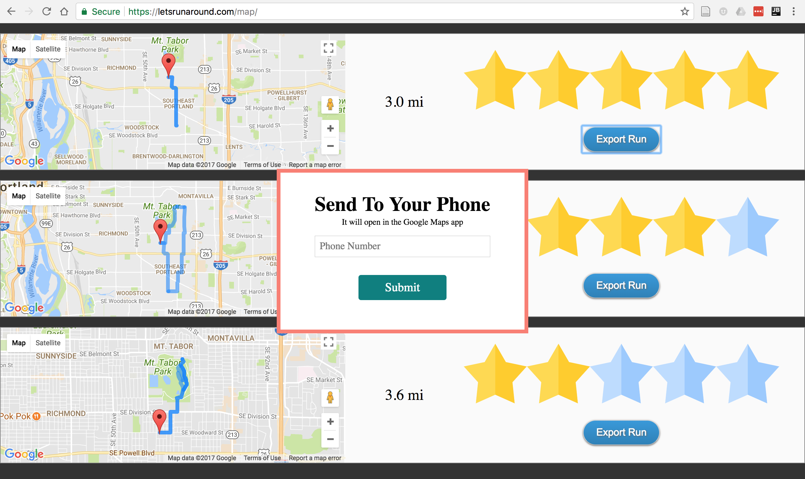

# RunAround

RunAround is a GeoDjango project that automatically builds runs for you based on the most popular runs for your area. You can find safe, popular runs
even when you're in new cities or spots you aren't familiar with.

It utilizes the Strava API to grab the most popular segments, decomposes them into points ranked by popularity, and then sends those points
to the Google Maps API to build a route. Finally, when you've selected the run you'd like, it texts the route
to you so you can open it in Google Maps for hands-free turn-by-turn directions on your phone while you run.

It is currently deployed to AWS Elastic Beanstalk as [https://letsrunaround.com](https://letsrunaround.com).

## Background

For context, the project proposal can be found [here](https://github.com/mike-jolliffe/RunAround/blob/master/proposal/proposal.md).

The following instructions will get you a copy of the project up and running on your local machine. Since the goal is local installation,
I will ignore discussions any files/folders used for deployment to Amazon Web Services via Elastic BeanStalk.

### Helpful web resources
[Setting up GeoDjango](https://docs.djangoproject.com/en/1.11/ref/contrib/gis/install/)

[GeoDjango tutorial](https://docs.djangoproject.com/en/1.11/ref/contrib/gis/tutorial/)

[Get a Google Maps JS API key](https://developers.google.com/maps/documentation/javascript/get-api-key)

[Google Maps API docs](https://developers.google.com/maps/documentation/javascript/tutorial)

[Google Directions API](https://developers.google.com/maps/documentation/directions/)

[Making Google Maps URLs for opening map in phone](https://developers.google.com/maps/documentation/urls/guide)

[Strava API information](https://developers.strava.com/docs/)

[Google Polyline encoding](https://developers.google.com/maps/documentation/utilities/polylinealgorithm)

[Decoding Google Polyline into lat/long data](https://pypi.python.org/pypi/polyline/)

[Making heatmaps from Google Fusion Tables](https://developers.google.com/maps/documentation/javascript/fusiontableslayer)

[Creating custom Amazon Machine Image](http://docs.aws.amazon.com/elasticbeanstalk/latest/dg/using-features.customenv.html)

[SSHing into your custom server instance](http://docs.aws.amazon.com/AWSEC2/latest/UserGuide/AccessingInstancesLinux.html)

### Prerequisites

RunAround is built with `Python 3.6`, `PostgreSQL`, `PostGIS`, and `Django 1.11`. In addition, it utilizes all the packages listed in the
`requirements.txt` file. Please install these into your environment.

### Project Structure

Inside RunAround is an app called `pages`. Within the `pages` app directory is a folder called `strava_api`. That folder is used
for getting the necessary Strava data and prepping it for storage in the Postgres
database.

First, by passing `getter.py` a bounding box of lat/longs, as well as how many sub-boxes to break it into (necessary because Strava
API will only return the ten most popular segments for a given box, so breaking it into a "mesh" of sub-boxes allows capturing
way more data), you can get the relevant Strava popularity data for your location of interest. The results are written to
the file `strava.txt`.

Next, running `prepper.py` will clean and transform the data from `strava.txt` into geoJSON that can be
consumed by the Postgres database using the PostGIS extension.

Now that the Strava data has been prepped, run `load.py` to load it into the database.

With a loaded database, go to the `templates` directory inside `pages`. Now `home.html` and `maps.html` can work.

