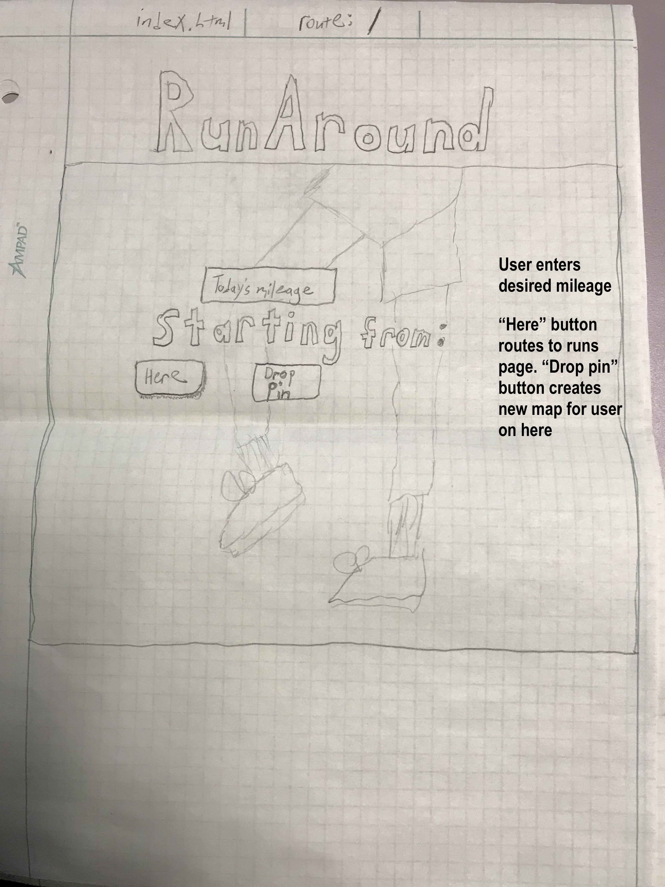
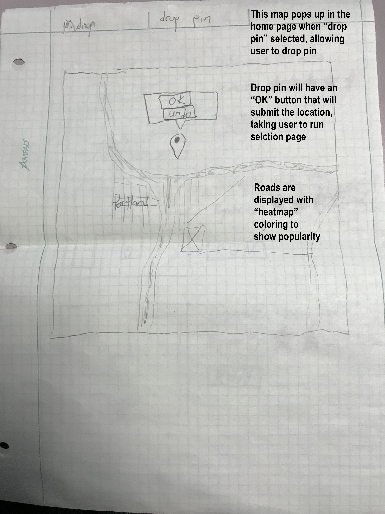
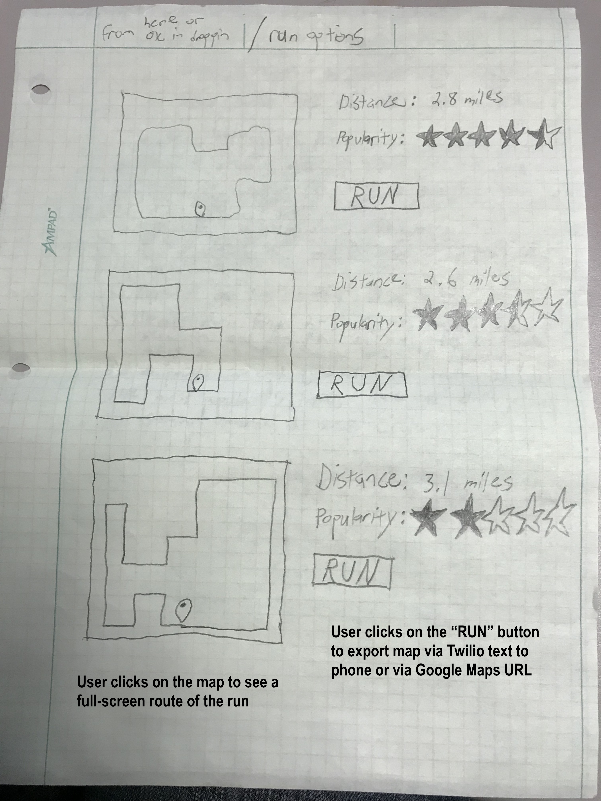

## Name

#### RunAround

## Product Overview

RunAround is a web app that will do the following:

    1.  Gather how far the user wants to run, whether they want a loop,
         an out-and-back, or a saved run, and whether they want to start
         from their current location or a
         dropped pin

    2.  Access the Strava API, gathering all run segments for the area
         and generating a heat network of most popular segments as polylines
         of points. Store those points in a database

    3.  Define a number of potential run solutions, calculated and
         sorted by popularity score.

    4.  Return a selection of possible runs, sorted by highest intersection with
         popular Strava segment waypoints

    5.  Send the directions URL of the chosen run to the user's phone or email for loading via
         Google Maps

    6.  Allow user to name/save the run for future use, or pick segments to
         avoid in the future (too busy/boring, etc.)

High-level functionality: user has traveled to a
new and unfamiliar city--or doesn't want to plan out a run--and would
like to go exercise. Not knowing what the local hotspots are, they just
plug in how far they want to run and where they want to start. The app
gives them a safe, popular route for exercise that they can plug into
their phone.

## Specific Functionality

### User Interface mock-ups

#### Home Page

#### Pin Drop Page

#### Select Your Run

### Flow of Information

1.  User inputs total mileage on homepage
2.  User provides location, either by clicking current
    location button, or dropping a pin
3.  Mileage and location are passed to a program that does
    the following:

    * Grab all Strava data within a (mileage / 2) distance of the given
          location from a SQL database (or via Strava API)
    * Snap given location to the nearest "node"
    * Run algorithm multiple times for routing through most popular/hottest nodes
    * Return the route/popularity score (relative hotness)

4.  Display list of routes for user to select/view, sorted by hotness
5.  Export the selected route to user's phone as a google maps URL using
    "send to phone" functionality or via Twilio

## Data Model

  * Starting location
  * Strava segment node locations (with hotness values)
  * Total mileage target
  * Potential Routes
  * Selected Route

The database of nodes and node scores will be queried using a bounding
box approach. Return all nodes where lat is within this range and lon is
within that range.

## Technical Components

### Moving parts

* Program to grab all Strava segment data, break it apart, store it in
  database

* Program to build a route by attempting to maximize total node score
  subject to mileage constraints

* Program to render webpages, collect user input, pass it to back end server

* Program to display route results, encode route info into a URL, export
  to user's phone

### Resources

[Strava API](https://strava.github.io/api/)

[Google maps API](https://developers.google.com/maps/)

or alternatively:

[Mapbox API](https://www.mapbox.com/mapbox-gl-js/api/)

## Schedule

### Tasks
1.  Build database of Strava nodes for Portland (or portion of)
    * Difficulty: Medium
    * Time: 20 hours
2.  Develop route-building algorithm
    * Difficulty: Very Hard / Hardest
    * Time: 80 hours
3.  Build static portions of website
    * Difficulty: Easy
    * Time: 8 hours
4.  Build dynamic portions of website (allow pindrop, show results)
    * Difficulty: Medium
    * Time: 20 hours
5.  Build and export URL to phone via Google or Twilio
    * Difficulty: Easy/Medium
    * Time: 12 hours
6.  Write README/docs for website
    * Difficulty: Easy
    * Time: 8 hours

### Total Time

#### 148 Hours over 3 weeks or ~ 50 hrs. / week

## Further Work

* Convert file to a GPX for import into strava as a route
* Create user profiles
* Ability to start in a local "hotzone"
* Allow labeling of runs with tags, sharing runs with others
* Incorporate elevation change in order to give a run a hilly-ness score
* Allow user to modify route prior to export
* Allow user to save runs
* Expand to bicycles, create use heat maps for transportation planners

